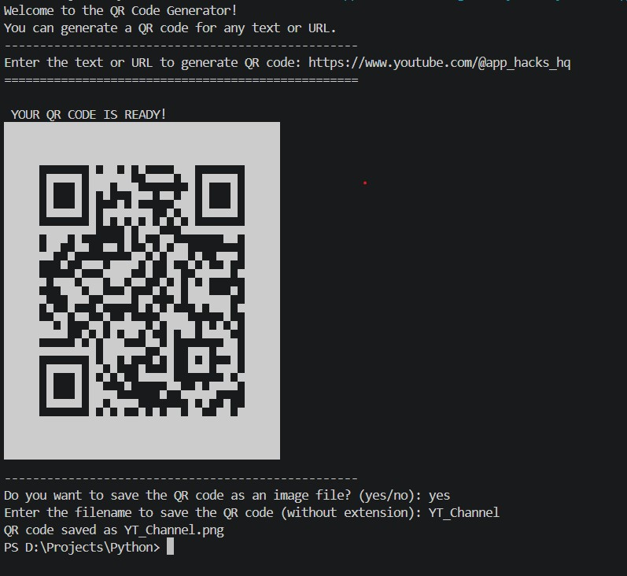

# 🔳 QR Code Generator

<p align="center">
  
  
  
  
  
</p>

<p align="center">
  
  
  
  
  
</p>

---

## 🧾 Overview

**QR Code Generator** is a Python command-line tool that converts any **text or URL** into a QR code — previewed instantly as ASCII art in the terminal and optionally saved as a **PNG image file**.

This is the first project in the repository to use an **external Python package** (`qrcode`), marking a step forward in the learning journey from pure built-in Python into the wider Python ecosystem.

---

## ✨ Features

| Feature | Description |
|---------|-------------|
| 🔗 **Any Text or URL** | Generate a QR code for any string — links, plain text, contact info, anything |
| 🖥️ **Live ASCII Preview** | Instantly renders the QR code as ASCII art directly in the terminal |
| 💾 **PNG Export** | Optionally saves the QR code as a named `.png` image file |
| 🎨 **Black & White Image** | Clean black-on-white PNG output ready for print or digital use |
| ⚙️ **Configurable** | `box_size` and `border` control QR code scale and quiet zone |

---

## 🧠 Concepts Practiced

<p>
  
  
  
  
  
  
  
  
</p>

- **External Packages** — first project using a third-party library (`qrcode`) installed via `pip`
- **`pip` & Dependencies** — installing and importing packages outside Python's standard library
- **Object Instantiation** — creating a `qrcode.QRCode` object with custom parameters
- **Method Calls** — using `.add_data()`, `.make()`, `.print_ascii()`, `.make_image()`, `.save()`
- **File I/O** — saving a generated image to disk with a user-defined filename
- **F-strings** — dynamically building the output filename string
- **Conditional Statements** — routing the save/skip decision with `if / elif / else`
- **`.lower()`** — normalising yes/no input for case-insensitive comparison

---

## 📋 Requirements

```
Python 3.x
qrcode
Pillow
```

> ⚠️ This project requires **external packages** — install them before running.

### Install Dependencies

```bash
pip install qrcode[pil]
```

> `qrcode[pil]` installs both the `qrcode` library and `Pillow` (required for PNG image export) in one command.

---

## 📁 Project Structure

```
📦 QR Code Generator/
│
├── 📄 QR_Code_Generator.py     # Main program file
├── 📄 README.md                # Project documentation
└── 📄 *.png                    # QR code images saved by 
```

---

## 🚀 Getting Started

### 1. Clone the Repository

```bash
git clone https://github.com/srichandratech-del/Python-Projects.git
```

### 2. Navigate to the Project Folder

```bash
cd "Python-Projects/QR Code Generator"
```

### 3. Install Dependencies

```bash
pip install qrcode[pil]
```

### 4. Run the Program

```bash
python QR_Code_Generator.py
```

---

## 💻 Example Usage

**Generating a QR Code for a URL**



---

## ⚙️ QR Code Settings

| Parameter | Value | Effect |
|-----------|-------|--------|
| `box_size` | `10` | Size of each QR module (pixel block) in the PNG output |
| `border` | `5` | Width of the quiet zone (white margin) around the QR code |
| `fill_color` | `"black"` | Foreground colour of the PNG |
| `back_color` | `"white"` | Background colour of the PNG |
| `fit` | `True` | Auto-sizes the QR code to fit the data length |

---

## 🔮 Future Improvements

- [ ] 🛡️ Add input validation — reject empty text input
- [ ] 🎨 Let the user choose custom foreground and background colours
- [ ] 📁 Let the user choose the save directory / file path
- [ ] 🔁 Add a loop to generate multiple QR codes in one session
- [ ] 🖼️ Add logo/icon embedding at the centre of the QR code
- [ ] 🖥️ Build a GUI version using Tkinter with a live preview window
- [ ] 📋 Add QR code type selector — URL, plain text, Wi-Fi, vCard

---

## 📚 Learning Outcome

This project was a significant step forward — the first time working with a **third-party Python package**. Key takeaways:

- How to find, install, and import packages from the Python ecosystem using `pip`
- Understanding the difference between built-in modules and external libraries
- Working with an **object-oriented API** — instantiating a class and calling its methods
- How to write generated content (an image) to disk as a named file
- That a small amount of library code can produce results that would take hundreds of lines to write from scratch

---

## 👨‍💻 Author

**Sri Chandra**

<p>
  
</p>

> 🌱 *Part of my ongoing Python learning journey — building real projects to solidify programming fundamentals.*

---

<p align="center">
  
  
</p>
